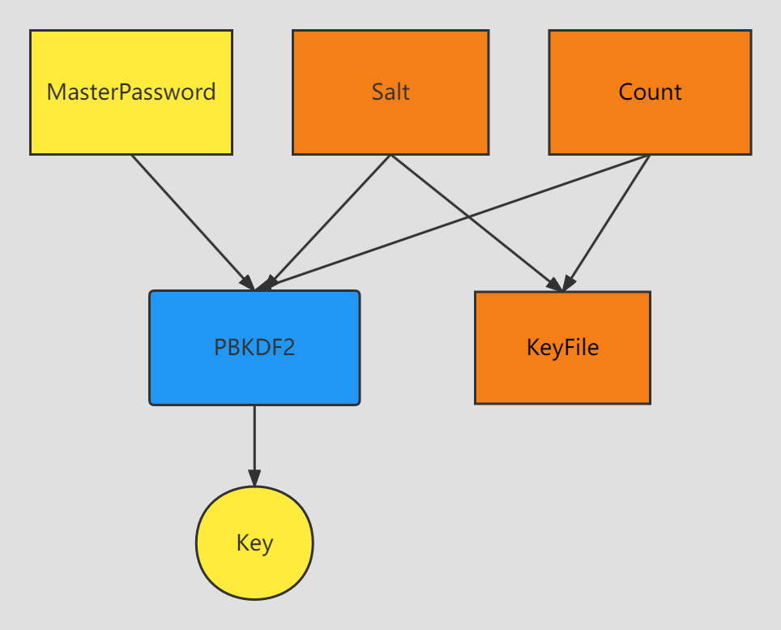
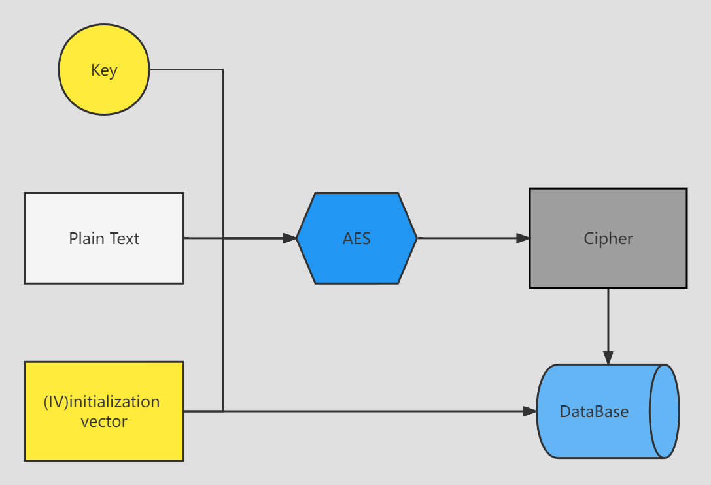
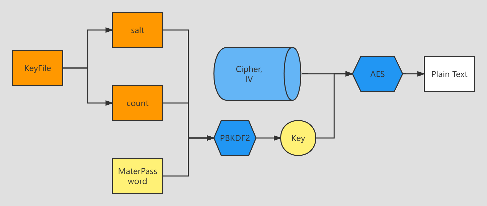

<h1 align="center"> Keyman </h1>
<p align="center">
    
</p>

A fast password manager written in Rust.

However, this is just the backend, if you want to use, you may need a application to use the api.

I recommend you to use the front [project](https://github.com/Jacen-cpu/keyman-front) by myself. 

## Main Algorithm


<p align="center">
we use PBKDF2 to the key.<br/>

</p>


<p align="center">
we use AES to enc user's password.

</p>

<p align="center">
This is how keyman dec the cipher.

</p>

by the way

you can see more design detail from my [slide](https://www.waysoahc.xyz/demo_slides/keyman/index.html#/).

## Usage

```rust
cargo run
```

## Basic api

```
(add_key)           POST    /api/ application/json
(get_all_key)       GET     /api/
(update_key)        PUT     /api/ application/json
(delete_key)        DELETE  /api/<id>
(login_master)      POST    /api/login application/json
(register_password) POST    /api/register application/json
(get_key)           GET     /api/<site_addr>
```

## License

GNU General Public License v3.0