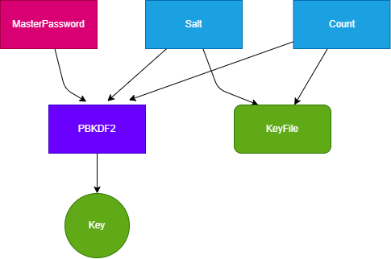

## what we need for the keyman?

user can CRUD its password

## something we can use.

- The Rocket to implemente our logic
- sqlite to store user's data

## design the datatable

```json
{
    "id" : "", 
    "name" : "",
    "password" : "",
    "email" : ""
}
```



## something about AES
1 word = 4 bytes = 32 bit
